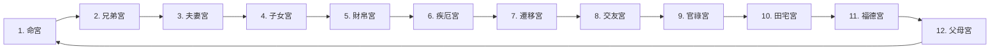

## 學習重點

十二宮的排列，可以用以下方式理解：
- 紫微命盤有十二個宮位，每個宮位代表不同人生主題。
- 命宮的位置是隨著出生資料不同而改變。
- 命宮確定後，其他宮位會依固定順序排列。
- 十二宮會對應十二地支位置。

## 十二宮總覽

| 宮位   | 觀察主題             | 理解方式           |
| ------ | ------------------------ | ---------------------- |
| 命宮   | 自我、個性、人生主軸     | 我是什麼樣的人         |
| 兄弟宮 | 手足、同輩、合作關係     | 我與同輩的互動         |
| 夫妻宮 | 感情、婚姻、伴侶模式     | 我如何經營親密關係     |
| 子女宮 | 子女、晚輩、創造力       | 我與下一代、作品的關係 |
| 財帛宮 | 金錢、收入、理財方式     | 我如何賺錢與用錢       |
| 疾厄宮 | 健康、身心狀態、壓力     | 我的身體與心理狀態     |
| 遷移宮 | 外出、環境、人際舞台     | 我在外界如何發展       |
| 交友宮 | 朋友、團隊、人脈         | 我身邊的人際圈         |
| 官祿宮 | 事業、工作、職涯方向     | 我適合怎麼工作         |
| 田宅宮 | 家庭、不動產、內在安全感 | 我的居住與根基         |
| 福德宮 | 精神狀態、享受、內在滿足 | 我如何感到快樂與安定   |
| 父母宮 | 父母、長輩、上司、制度   | 我與權威、長輩的關係   |


## 十二宮排列順序

在常見紫微命盤中，十二宮會按照固定順序逆時針排列，也就是說，命宮確定後，會依序排出：


以下會有十二宮詳細介紹。
## 命宮：自我與人生主軸

- 命宮是整張命盤中非常核心的位置，它主要用來觀察一個人的個性、氣質、思考方式、行動風格，以及人生中最核心的發展方向。
- 命宮可以想像成一個人的「角色設定」或「人生起點」，如果把命盤比喻成一款 RPG 遊戲，命宮就像是角色創建時的基本能力與個性設定。
``` 
命宮常看的問題：
    - 我是什麼樣的人？
    - 我的個性核心是什麼？
    - 我的優勢與盲點在哪裡？
    - 我適合用什麼方式發展自己？
```

## 兄弟宮：手足與同輩關係

- 兄弟宮主要觀察兄弟姊妹、同輩、同學、同事，或與自己年齡、地位相近的人際互動。
- 它不只看真正的兄弟姊妹，也可以延伸理解為「平輩關係」。
- 兄弟宮可以想像成你人生中的「同伴區」，它反映你和同輩之間是容易互相支持，還是容易競爭、疏離或各自獨立。
``` 
兄弟宮常看的問題：
    - 我與兄弟姊妹的關係如何？
    - 我與同輩互動的模式是什麼？
    - 我適合單打獨鬥，還是與同輩合作？
    - 我身邊的平輩關係是否能帶來支持？
``` 

## 夫妻宮：感情與伴侶模式

- 夫妻宮主要觀察感情、婚姻、伴侶互動，以及一個人在親密關係中的期待與課題。
- 它不只是看「會不會結婚」，更重要的是看一個人如何面對感情、喜歡什麼樣的互動模式，以及在關係中容易遇到什麼狀況。
``` 
夫妻宮常看的問題：
    - 我在感情中重視什麼？
    - 我容易被什麼樣的人吸引？
    - 我的伴侶互動模式是什麼？
    - 感情中容易出現哪些課題？
    - 我適合什麼樣的關係節奏？
```

## 子女宮：子女、晚輩與創造力

- 子女宮主要觀察子女、晚輩、學生、部屬，也可以延伸看一個人的創造力、作品、成果與延續性。
- 對現代人來說，即使沒有子女，子女宮仍然可以用來理解一個人如何創造、培養、照顧，或把自己的想法延伸成作品。
- 子女宮可以想像成命盤中的「創造與延續區」。
``` 
子女宮常看的問題：
    - 我與子女或晚輩的關係如何？
    - 我是否擅長照顧、教導或培養他人？
    - 我的創造力如何？
    - 我適合發展什麼樣的作品或成果？
    - 我如何看待責任與延續？
```

## 財帛宮：金錢與資源管理

- 財帛宮主要觀察金錢觀、賺錢方式、收入型態、理財態度，以及一個人如何看待資源。
- 它不是單純看「有沒有錢」，而是看一個人適合用什麼方式創造收入，以及面對金錢時的習慣與模式。
- 財帛宮可以想像成命盤中的「金庫」或「資源管理室」。
``` 
財帛宮常看的問題：
    - 我適合怎麼賺錢？
    - 我的金錢觀是什麼？
    - 我花錢與存錢的習慣如何？
    - 我適合穩定收入，還是多元收入？
    - 我容易在哪些地方產生財務壓力？
```

## 疾厄宮：健康與身心狀態

- 疾厄宮主要觀察身體狀況、健康傾向、壓力反應，以及一個人的內在消耗方式。
- 它不只是看疾病，也可以看一個人如何承受壓力、情緒如何累積，以及身心是否容易失衡。
- 疾厄宮可以想像成命盤中的「身心儀表板」。
``` 
疾厄宮常看的問題：
    - 我的身體容易在哪些地方累積壓力？
    - 我面對壓力時會如何反應？
    - 我的作息與身心狀態需要注意什麼？
    - 我是容易外顯壓力，還是內在消耗？
    - 我需要用什麼方式照顧自己？
```

## 遷移宮：外部環境與人生舞台

- 遷移宮主要觀察外出、移動、旅行、異地發展、外部機會，以及一個人在外界環境中的表現。
- 它可以看一個人離開熟悉環境後，是否容易遇到機會，或在外部世界中如何被看見。
- 遷移宮可以想像成命盤中的「外部舞台」。
``` 
遷移宮常看的問題：
    - 我適合外地發展嗎？
    - 我在外界給人的印象如何？
    - 我離開熟悉環境後是否容易有機會？
    - 我適合曝光、出差、旅行或跨領域發展嗎？
    - 外部環境對我的影響大不大？
```

## 交友宮：朋友、人脈與團隊

- 交友宮主要觀察朋友、社群、團隊、合作對象、人脈關係，也可以看一個人在群體中的互動模式。
- 它不是單純看朋友多不多，而是看人際圈的品質、互動方式，以及是否容易遇到貴人、競爭者或消耗型關係。
- 交友宮可以想像成命盤中的「社交圈」。
``` 
交友宮常看的問題：
    - 我的朋友與人脈關係如何？
    - 我適合在團隊中扮演什麼角色？
    - 我容易遇到支持型朋友，還是消耗型關係？
    - 我的人際圈對我有幫助嗎？
    - 我適合經營社群或合作關係嗎？
``` 
## 官祿宮：事業與職涯方向

- 官祿宮主要觀察工作風格、事業方向、職涯發展、成就感來源，以及一個人適合在什麼樣的環境中發揮。
- 它不是只看職業名稱，而是看一個人的工作模式與成就路線。
- 官祿宮可以想像成命盤中的「工作室」或「事業舞台」。
``` 
官祿宮常看的問題：
    - 我適合什麼樣的工作方式？
    - 我的職涯發展重點是什麼？
    - 我適合管理、專業、創意、服務，還是開創型工作？
    - 我在工作中重視穩定、成就、自由，還是影響力？
    - 我的事業容易遇到什麼課題？
```

## 田宅宮：家庭、居住與根基

- 田宅宮主要觀察家庭環境、居住狀態、不動產、資產基礎，也可以延伸看一個人的安全感與內在根基。
- 它不只是看房子，也看一個人是否重視穩定、歸屬感與生活空間。
- 田宅宮可以想像成命盤中的「家」與「基地」。
``` 
田宅宮常看的問題：
- 我與家庭環境的關係如何？
    - 我是否重視居住品質？
    - 我適合累積不動產或固定資產嗎？
    - 我的安全感來自哪裡？
    - 我對家的想像是什麼？
``` 

## 福德宮：精神狀態與內在滿足

- 福德宮主要觀察一個人的精神世界、內在快樂、享受方式、價值感與心靈狀態。
- 它可以看一個人是否容易感到滿足，是否容易焦慮，或需要透過什麼方式讓自己放鬆與恢復能量。
- 福德宮可以想像成命盤中的「心靈休息室」。
``` 
福德宮常看的問題：
    - 我如何感到快樂？
    - 我的精神狀態是否容易緊繃？
    - 我需要什麼樣的休息方式？
    - 我重視物質享受，還是精神滿足？
    - 我內在是否容易感到安定？
```

## 父母宮：父母、長輩與權威關係

- 父母宮主要觀察父母、長輩、上司、師長、制度，以及一個人面對權威時的互動模式。
- 它不只看原生家庭，也可以延伸到職場中的主管、社會規則、制度資源。
- 父母宮可以想像成命盤中的「權威與支持系統」。
``` 
父母宮常看的問題：
    - 我與父母、長輩的關係如何？
    - 我容易得到長輩或上司的支持嗎？
    - 我面對權威時是順從、抗拒，還是理性互動？
    - 我與制度、規則的關係如何？
    - 我是否容易受到家庭背景影響？
```
